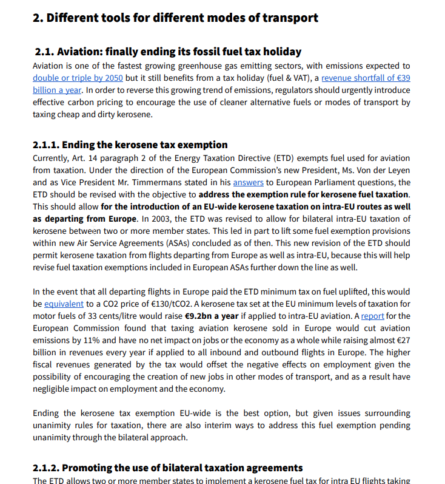
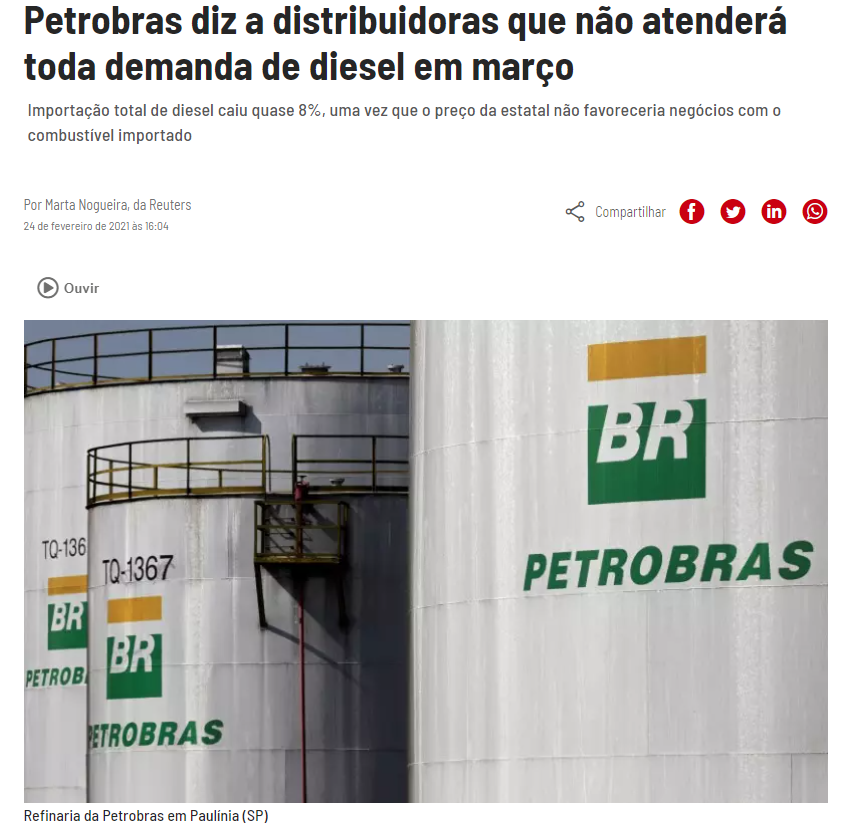
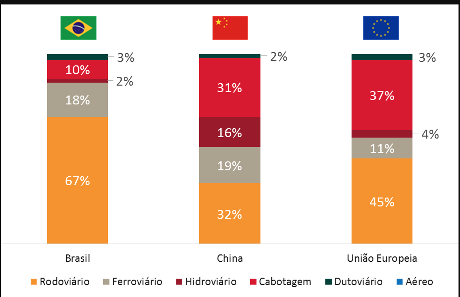
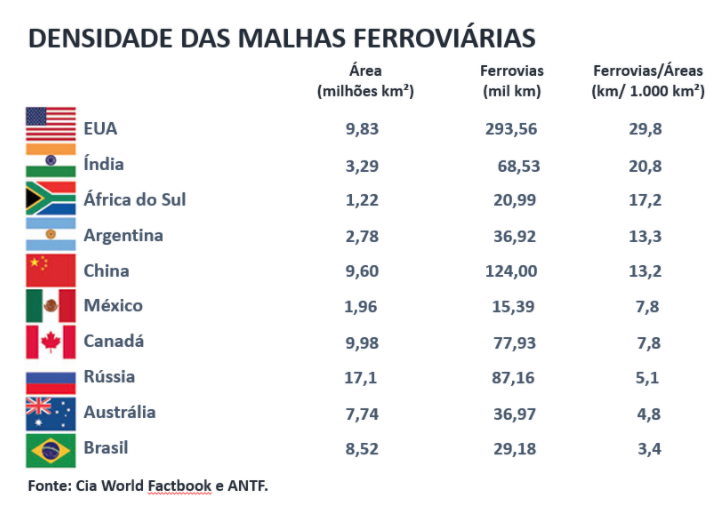
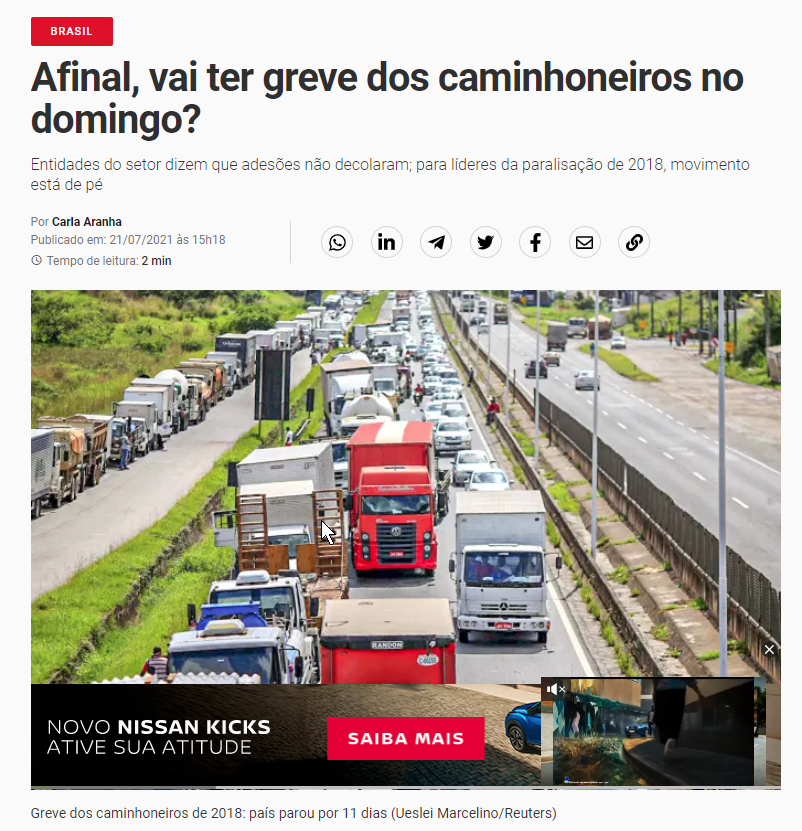

```{r child = "setup.Rmd"}
```

```{r xaringan-tile-view, echo=FALSE}
xaringanExtra::use_tile_view()
```

```{r xaringan-editable, echo=FALSE}
xaringanExtra::use_editable(expires = 1)
```

```{r xaringan-panelset, echo=FALSE, message=FALSE, warning=FALSE}
xaringanExtra::use_panelset()
xaringanExtra::style_panelset_tabs(panel_tab_font_family = "sans-serif")
```

```{r xaringanExtra-clipboard, echo=FALSE}
htmltools::tagList(
  xaringanExtra::use_clipboard(
    button_text = "<i class=\"fa fa-clipboard\"></i>",
    success_text = "<i class=\"fa fa-check\" style=\"color: #90BE6D\"></i>",
    error_text = "<i class=\"fa fa-times-circle\" style=\"color: #F94144\"></i>"
  ),
  rmarkdown::html_dependency_font_awesome()
)
```

```{r xaringan-fit-screen, echo=FALSE}
xaringanExtra::use_fit_screen()
```

```{r xaringan-extra-styles, echo=FALSE}
xaringanExtra::use_extra_styles(
  hover_code_line = TRUE,         #<<
  mute_unhighlighted_code = TRUE  #<<
)
```

```{css include=FALSE}
.panelset {
   --panel-tab-foreground: currentColor;
   --panel-tab-background: unset;
   --panel-tab-active-foreground: currentColor;
   --panel-tab-active-background: unset;
   --panel-tab-active-border-color: currentColor;
   --panel-tab-hover-foreground: currentColor;
   --panel-tab-hover-background: unset;
   --panel-tab-hover-border-color: currentColor;
   --panel-tab-inactive-opacity: 0.5;
   --panel-tabs-border-bottom: #ddd;
   --panel-tab-font-family: Sen;
   --panel-tab-background-color-active: #fffbe0;
   --panel-tab-border-color-active: #023d4d;
}

.panelset .panel-tabs .panel-tab > a {
	color: #023d4d;
}

.panelset .panel-tabs {
  font-size: 0.5rem;
}
```

class: center, middle

## Retrospecto

---

## Definições

### Logística

.midi[
.question[
“**Logística** é dispor a **mercadoria ou o serviço** certo, no **lugar** certo, no **tempo** certo e nas **condições desejadas**, ao mesmo tempo em que fornece a **maior contribuição à empresa**”. 
(Ballou, 2001)
]
]

### Gestão Cadeia de Suprimentos

.question[
.midi[
**Cadeia de suprimentos** é a estrutura consolidada e integrada, em níveis estratégico, tático e operacional, entre agentes de produção, mercadológicos, logísticos e sociedade, para que seja possível coordenar as operações de maneira a garantir a gestão orientada à logística, tendo como objetivo o _trade-off_ entre **responsividade** e **eficiência**, além de garantia de um contexto sustentável de desenvolvimento por ações **socialmente responsáveis** e **resilientes.** 
]
]

---

## Fatores-chave de desempenho

- Instalações   
- Estoques   
- Transportes   
- Informação   
- Sourcing   
- Pricing

---

class: center, middle

## Logística Urbana
[Livro](https://podeditora.com.br/wp-content/uploads/2019/04/Livro-A-logistca-urbana-no-Brasil-site.pdf)


---

class: center, middle

## Transportes

---
# Modos de transporte

Quais são os modos utilizados para movimentação de cargas?


--

Rodoviário

--

Ferroviário

--

Aquaviário

--

Dutoviário

--

Aéreo

--

Eletrônico


---

class: center, middle

## Qual o(s) problema(s) do Brasil em relação à movimentação de cargas em escala regional?


---

class: center

### No mundo....

```{r echo=FALSE, message=FALSE, warning=FALSE}
knitr::include_graphics("./img/japao.png")
```

---

class: center

### No mundo....

```{r echo=FALSE, message=FALSE, warning=FALSE}
knitr::include_graphics("./img/singapore.png")
```

---

class: center

### No mundo....

```{r echo=FALSE, message=FALSE, warning=FALSE}

```

---

class: center

### No mundo....

```{r echo=FALSE, message=FALSE, warning=FALSE}

```

---

class: center

### No mundo....

```{r echo=FALSE, message=FALSE, warning=FALSE}
knitr::include_graphics("./img/electric vechicle.png")
```

---

class: center

### No mundo....

```{r echo=FALSE, message=FALSE, warning=FALSE, out.width="50%"}
knitr::include_graphics("./img/growth_emission.png")
```

---
### Qual o nosso problema?
Preço do petróleo?

```{r echo=FALSE, message=FALSE, warning=FALSE}
knitr::include_graphics("./img/diesel.png")
```

---
### Rodovias

```{r echo=FALSE, message=FALSE, warning=FALSE}

```


---
### Ferrovias

```{r echo=FALSE, message=FALSE, warning=FALSE}

```


---
### Aquaviário - Águas interiores

```{r echo=FALSE, message=FALSE, warning=FALSE}

```

---


### Qual o nosso problema?
Demanda x oferta?

```{r echo=FALSE, message=FALSE, warning=FALSE}

```

---
### Qual o nosso problema?
Matriz modal?

```{r echo=FALSE, message=FALSE, warning=FALSE}
knitr::include_graphics("./img/matriz_modal.png")
```

---

### Qual o nosso problema?
Matriz modal?

```{r echo=FALSE, message=FALSE, warning=FALSE}

```

---
### Qual o nosso problema?
Matriz modal?

```{r echo=FALSE, message=FALSE, warning=FALSE}
knitr::include_graphics("./img/ferro.png")
```

---

### Qual o nosso problema?
Matriz modal?

```{r echo=FALSE, message=FALSE, warning=FALSE}
knitr::include_graphics("./img/investimento.png")
```

---

### Qual o nosso problema?
Matriz modal?

```{r echo=FALSE, message=FALSE, warning=FALSE}
knitr::include_graphics("./img/matriz_compara.png")
```

---
### Qual o nosso problema?
Matriz modal?

```{r echo=FALSE, message=FALSE, warning=FALSE}

```

---

### Qual o nosso problema?
Matriz modal?

```{r echo=FALSE, message=FALSE, warning=FALSE}
knitr::include_graphics("./img/conteiner.png")
```

---

### Qual o nosso problema?
Custo da produção de transportes

```{r echo=FALSE, message=FALSE, warning=FALSE}

```

---

### Qual o nosso problema?
Eficiência da produção de transportes

```{r echo=FALSE, message=FALSE, warning=FALSE}

```


---

### Como resolver?

"Bolsa Caminhoneiro"?

```{r echo=FALSE, message=FALSE, warning=FALSE}
knitr::include_graphics("./img/bolsa.png")
```

---

### Como resolver?

"Bolsa Caminhoneiro"?

```{r echo=FALSE, message=FALSE, warning=FALSE}
knitr::include_graphics("./img/rebate.png")
```

---

### Como resolver?

Realocação de recursos? 
Eliminar piso de gastos com educação e saúde para subsidiar Diesel?
Intervir na Petrobrás?
Privatizar a Petrobras?

```{r echo=FALSE, message=FALSE, warning=FALSE}
knitr::include_graphics("./img/calamidade.png")
```


---
### Como resolver?


- Fim da política de preços da Petrobras para os combustíveis
- Cumprimento do piso mínimo de frete

```{r echo=FALSE, message=FALSE, warning=FALSE}

```

---
### Revisão de Gestão de Estoques
- Quanto pedir   
  - Custos de estoques   
  - Lote econômico de compras   

- Quando pedir   
  - Revisões contínuas e periódicas

- Como controlar o sistema   
  - Curva ABC   
  - Inventário   
  - Planejamento de estoques de segurança   

---

## Atividades da semana

Prazo | Atividade
------|----------
23/06/2021|[**Estudos Autônomos** - Nível de serviço logístico](https://retaoliveira.github.io/places/courses/log/est_1/)
28/06/2021|[**Estudos Autônomos** - KPI](https://retaoliveira.github.io/places/courses/log/est_2/)
28/06/2021|[**Projeto 1**](https://retaoliveira.github.io/places/courses/log/project1/)
04/08/2021|[**Estudos Autônomos** - Logistica Urbana](https://retaoliveira.github.io/places/courses/log/est_3/)
04/08/2021|[**Estudos Autônomos** - Transportes](https://retaoliveira.github.io/places/courses/log/est_4/)
04/08/2021|[**Estudos Autônomos** - Gestão de Estoques](https://retaoliveira.github.io/places/courses/log/est_5/)

---

class: center, middle

.larger[
**DÚVIDAS?**
]
